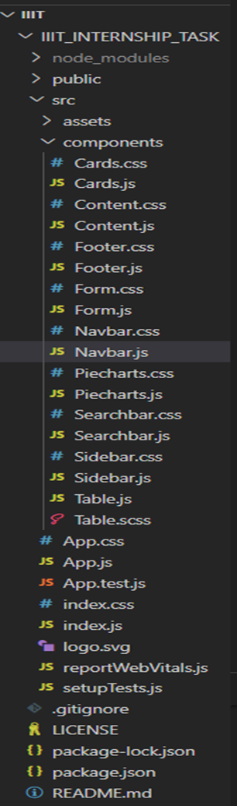
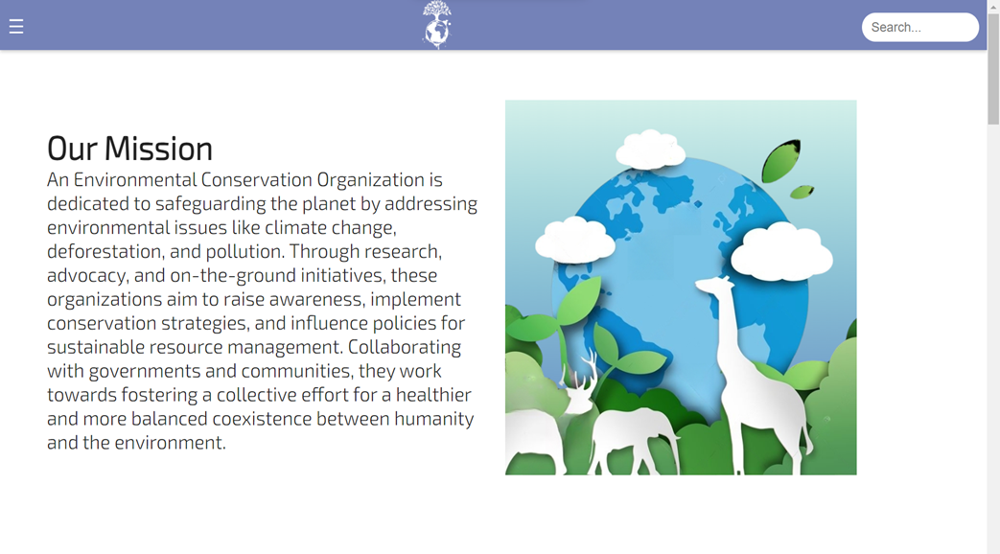
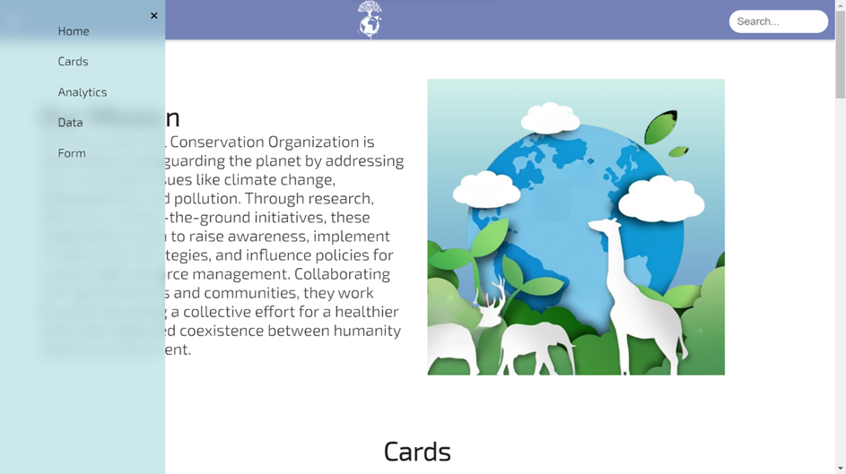
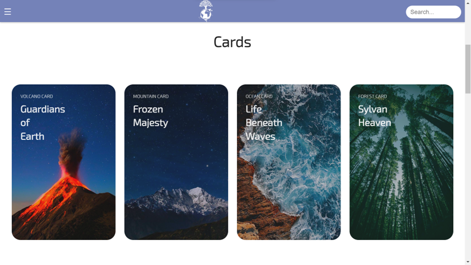
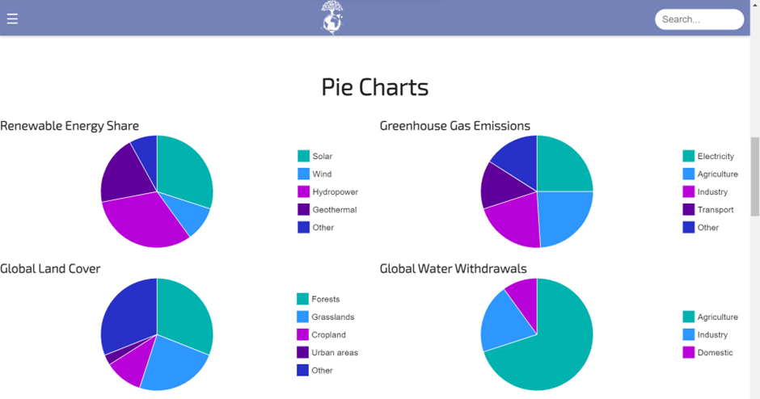
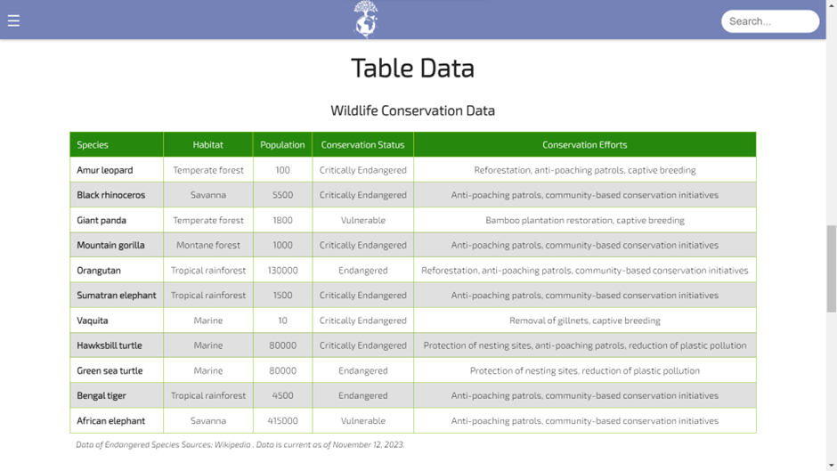
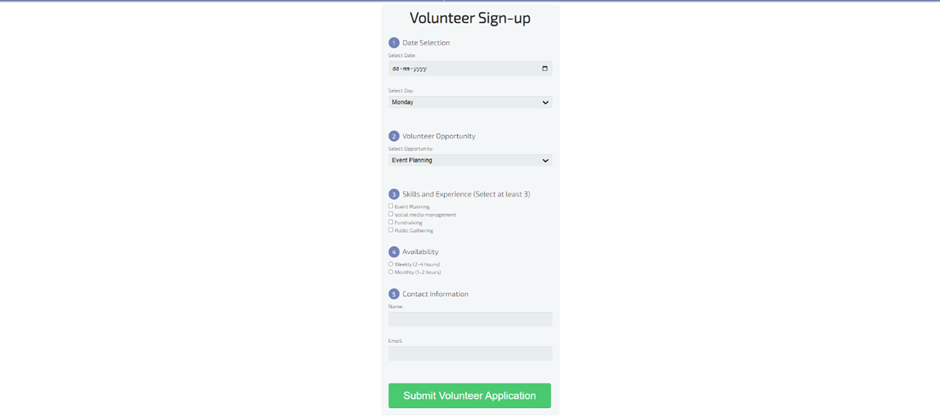
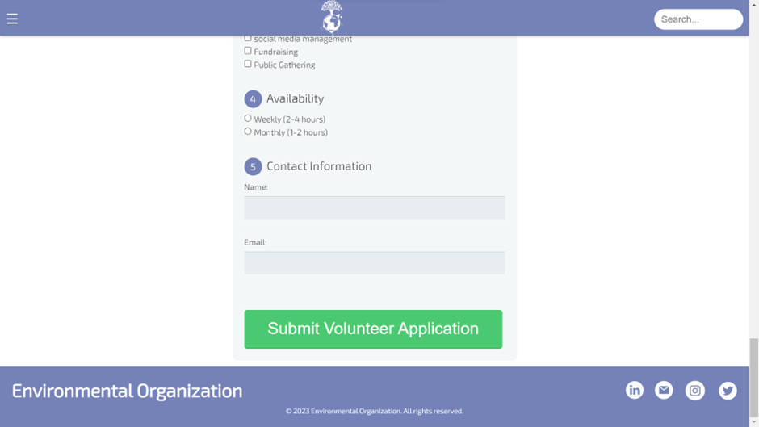

# IIIT_INTERNSHIP_TASK

## Table of Contents
- Introduction
- Problem Statement
- Technologies used
- Modules Used
- Required Installations
- Project flow
- Components
- Conclusion

## Problem Statement:

Task is to create your own webpage by using the React components below:
1.	Navbar
2.	Sidebar
3.	Search bar
4.	Cards with any kind of information related to your webpage, one image and some content need to be on every card (Minimum of 4)
5.	Piecharts, which represents any kind of information related to your webpage (Minimum of 4)
6.	Table with minimum of 5 columns and 4 rows
7.	Form [Date and Day selection, Dropdown, Check boxes (min of 3), Radio buttons (min of 2), Text boxes (min of 2), Button]
8.	Footer (content related to the webpage you chose) You should be able to create app pages that show smooth responsive behavior that adapts to screen size as well as device type. The webpage theme and design are your choice.

## Introduction:

In today's world, environmental concerns are at the forefront of global discourse. As we grapple with the challenges of climate change, pollution, and dwindling natural resources, the need for effective environmental organizations has never been more pressing. This project aims to create a comprehensive web page dedicated to environmental awareness and action, using React as the development framework. The web page will feature four interactive pie charts, each showcasing critical data related to environmental issues. These charts will depict the Renewable Energy Share, Greenhouse Gas Emissions, Global Land Cover, and Global Water Withdrawals, providing a visual representation of the current state of our planet's resources. To further highlight the urgency of environmental protection, a table will be presented, detailing the alarming number of endangered species worldwide. This table will serve as a stark reminder of the delicate balance of ecosystems and the consequences of human activities. To empower individuals to make a difference, a prominent sign-up form will be integrated into the web page. This form will allow visitors to register as volunteers, enabling them to connect with local environmental organizations and contribute to various conservation efforts.
This web page, developed using React, will serve as a valuable resource for anyone seeking to understand and address environmental challenges. By providing clear and concise information, engaging data visualizations, and a platform for volunteer engagement, this project aims to inspire action and foster a more sustainable future for our planet.

## Technologies used:

### React.js :

React.js simplifies UI development through its component-based architecture, enhancing code reusability and performance optimizations for dynamic web interfaces. Its virtual DOM efficiently updates the actual DOM, leading to faster rendering and improved user experience.
Create a new React app
Open your terminal or command prompt and use the npx command to create a new React app. Run the following command:
```
 npx create-react-app client
```

## Modules Used:

### React:

The core library for building UI components in JavaScript.

### react-router-dom:

•	Route: A React component that renders some UI when its path matches the current URL.
•	Routes: A component that declares the different routes within the application and renders matching routes.

### useState:

A React hook used for managing component-level state in functional components.

### react-chartjs:

React wrapper for Chart.js library to create charts in React applications.

### chart.js/auto:

Latest version of Chart.js library to provide functionalities for creating various charts.

### useRef:

A React hook used to create a mutable ref object to persist values across renders without causing re-renders.


## Installations Required:

To run the code, ensure you have installed the following npm packages:

•	Make sure you have Node.js installed on your machine.

To run the component, you'll need to install the following npm packages:
```
npm install react   
npm install react-icons    
npm install react-chartjs-chart.js
npm install react-router-dom   
```

## Project Flow

The first step involves creating a folder named IIIT . Within the IIIT_INTERNSHIP_TASK directory, three subfolders were created: assets, components. The folder structure is as depicted below:





## Components:

### Navbar:

The Navbar component encapsulates a logo , searchbar and sidebar imported & included in the Navbar itself.


### Sidebar:

The Sidebar component features a collapsible menu for rapid access to distinct application sections. It includes:


- Home
- Cards
- Analytics
- Data
- Form



### Searchbar

A user-friendly component facilitating effortless interaction with the search


### Cards

The Cards component presents 4 Cards Abou the Nature.



### PieCharts

The PieCharts component, driven by React and Chart.js, showcases:
- Chart.js-rendered pie charts illustrating Renewable Energy Share,Greenhouse Gas Emissions,Global Land Cover,Global Water Withdrawals.



### Table

The Table component, constructed using React, offers:
- An extensive table displaying Information About the Endangered Species



### Form

The Form component is a Signup from to register as volunteer for behalf of Organisation.



### Footer

The Footer component comprises:
- Environmental Organisation
- Meta links for Socail handles Twitter,LinkedIn,Instagram and Mail.
- Copy Rights section



